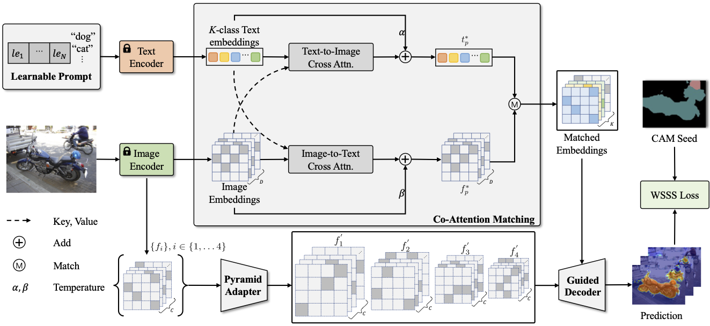

<div align="center">
<h1>WeakCLIP </h1>
<h3>Adapting CLIP for Weakly-supervised Semantic Segmentation</h3>

[Lianghui Zhu](https://github.com/Unrealluver)<sup>1</sup> \*, [Xinggang Wang](https://scholar.google.com/citations?user=qNCTLV0AAAAJ&hl=zh-CN)<sup>1 :email:</sup>, Jiapei Feng<sup>1</sup> \*, [Tianheng Cheng](https://scholar.google.com/citations?hl=zh-CN&user=PH8rJHYAAAAJ)<sup>1</sup> \*, Yingyue Li<sup>1</sup> \*, Dingwen Zhang<sup>2</sup>, Junwei Han<sup>2</sup>
 
<sup>1</sup> Huazhong University of Science and Technology, Wuhan, China, <sup>2</sup> Northwestern Polytechnical University, Xi’an, China 

(\*) equal contribution, (<sup>:email:</sup>) corresponding author.

ArXiv Preprint ([arXiv ]())

</div>

## Introduction 
Within the realm of weakly-supervised semantic segmentation (WSSS), it is always challenging to obtain sufficient and reliable pixel-level supervision from image-level annotations. Previous WSSS methods typically first generate a coarse class activation map (CAM) from classification networks, followed by the refinement of this CAM to produce high-quality pseudo masks, a step aided by hand-crafted priors. 

The recent advancements in large-scale Contrastive Language and Image Pre-training (CLIP) present an opportune avenue for the enhancement of weakly-supervised image understanding, impacting the creation of high-quality pseudo masks. However, directly applying CLIP to WSSS cannot refine the CAM to be aware of three significant challenges: 1) the task gap between contrastive pre-training and WSSS CAM refinement, 2) lacking text-to-pixel modeling to fully utilize the pre-trained knowledge, and 3) the insufficient details brought by $\frac{1}{16}$ down-sampling resolution of ViT. 
Thus, we propose WeakCLIP to address the challenges and leverage the pre-trained knowledge from CLIP to WSSS.

Comprehensive experiments demonstrate that WeakCLIP provides an effective way to transfer CLIP knowledge to refine CAM and achieves the state-of-the-art WSSS performance on standard benchmarks, 74.0% mIoU on the $val$ set of PASCAL VOC 2012 and 46.1% mIoU on the $val$ set of COCO 2014.

<div align=center></div>

## Getting Started
- [Environment Setup ](docs/Install.md)
- [Prepare Dataset](docs/prepare_dataset.md)
- [TrainEval](docs/TrainEval.md)
- [Deeplab Retraining](deeplabv1-resnet38/README.md)

## Model Zoo
|     Dataset     |                            Checkpoint                          |                          Pseudo Mask                           | Train mIoU |       Retrain Checkpoint                        | Val mIoU |
| :-----------: | :----------------------------------------------------------: | :----------------------------------------------------------: | :--------: |:----------------------------------------------------------: | :--------: |
| Pascal VOC 2012 | [Google Drive](https://drive.google.com/file/d/1RMGRNKF-xbs5ZQ1Z0d7LYl5qwdlpT3_d/view?usp=drive_link) | [Google Drive](https://drive.google.com/file/d/1innDS3W5Tq73ZuVBw7KCJ54qDyDMTYPH/view?usp=share_link) |   **77.2%**    |[Google Drive](https://drive.google.com/file/d/1kWpKPSvEflmODZe5PgJtMaZWlV3WC_AJ/view?usp=drive_link) |   **74.0%**    |
| COCO 2014 |   [Google Drive](https://drive.google.com/file/d/1Jxx8lerJoQtuu0uOknaXFOUIX5Vu4GEM/view?usp=drive_link) | [Google Drive](https://drive.google.com/file/d/1EXsVjIBjaw3lZlwwGteS9vXZnKXXx4n-/view?usp=share_link) |   **48.4%**    |[Google Drive](https://drive.google.com/file/d/1W_t2A0cakLcfmrlvWxAG0Ql5KU2G8WQM/view?usp=share_link) |   **46.1%**    |
## License
MIT License

## Citation
If you find our work useful in your research, please consider citing:
```
@inproceedings{
}
```
